# World Generator

A procedural world generator written in Rust, designed as the foundation for **[0 C.E.](https://github.com/0-C-E)** -- an open-source ancient world strategy game (MMORTS). It generates a 10,000 * 10,000 tile ocean-and-islands map complete with terrain, biomes, cities, resource economies, and island boundaries. The generated world is explored via a zoomable web-based map viewer.

## Features

The generator produces a fully-featured game world:

- **Fractal terrain** -- Perlin noise-based heightmap with natural coastlines and mountains
- **Island discovery** -- Automatic detection of distinct landmasses via flood-fill
- **City placement** -- Strategic coastal positions with configurable spacing and density
- **Biome classification** -- 16 terrain types (plains, forest, desert, mountains, etc.) with distinct resource properties
- **Resource simulation** -- Per-city production modifiers and gold deposits
- **Village system** -- Inland resource nodes with trade specialization (Wood, Stone, Food, Metal)
- **Web viewer** -- Interactive Leaflet.js map with panning, zooming, and detailed overlays
- **Efficient storage** -- Chunked and compressed binary format with O(1) random access
- **Deterministic generation** -- Same seed always produces identical worlds

## What is this project? (The big picture)

Imagine games like [Grepolis](https://en.wikipedia.org/wiki/Grepolis), [0 A.D.](https://play0ad.com/), [Tribal Wars](https://www.tribalwars.net/en-dk/), [Age of Empires](https://www.ageofempires.com/), or [Civilization VI](https://civilization.2k.com/) -- hundreds of players share a single world map made up of ocean, islands, and cities. Each island has a limited number of city slots that players can colonize, fight over, and develop.

**This project generates that entire game world from scratch.** It doesn't just draw a pretty picture -- it produces a structured data file that a game server could use to run an actual online strategy game. Specifically, it:

1. **Generates terrain** -- builds a realistic heightmap using [Perlin noise](https://en.wikipedia.org/wiki/Perlin_noise), then classifies every tile as water, land, or decorative border.
2. **Discovers islands** -- uses flood-fill to label connected land tiles, turning them into distinct islands with unique IDs.
3. **Places cities** -- finds valid coastal positions (next to ocean, spaced apart) and assigns them to islands, discarding tiny islands with too few slots.
4. **Classifies biomes** -- layers 6 Perlin noise fields (continentalness, elevation, erosion, temperature, peaks/valleys, divine favor) to assign each tile a strategically meaningful biome (Forest, Desert, Sacred Grove, etc.).
5. **Computes city resources** -- scans tiles around each city to aggregate production modifiers (wood, stone, food, metal, favor) and locate gold vein nodes.
6. **Saves everything** -- writes a compact binary file (`.world`) where the map is split into compressed chunks so any small area can be loaded instantly without reading the whole file.
7. **Serves a web viewer** -- runs a tiny HTTP server that renders map tiles on demand, and the browser shows a full zoomable map with island labels, city markers, and resource popups via [Leaflet.js](https://leafletjs.com/).

### Why Rust?

Rust gives us the speed to generate and serve a 100-million-tile world in under a minute, with safe memory management and no garbage collector pauses -- important for a game server that needs to stay responsive.

## Architecture

The generation pipeline is modular and data-driven:

```mermaid
flowchart TD
  subgraph SG[" "]
  direction LR
    A["Elevation generation<br/>(Perlin noise)"]
    B["Terrain classification<br/>(Water / Land / FarLand)"]
    C["Region labeling<br/>(Flood-fill → Islands)"]
    D["Water body detection<br/>(Connected components)"]
    E["Ocean distance field<br/>(For village placement)"]
    F["City placement<br/>(Coastal search + minimum spacing)"]
    G["Island filtering<br/>(Discard too-small islands)"]
    H["Biome classification<br/>(6 noise layers → 16 types)"]
    I["City resource computation<br/>(Per-city modifiers + gold)"]
    J["Village placement<br/>(Island-based distribution)"]
    K["Binary serialization<br/>(Chunks + compression)"]

    A --> B
    B --> C
    C --> D
    D --> E
    E --> F
    F --> G
    G --> H
    H --> I
    I --> J
    J --> K
  end
```



### Module organization

| Module | Responsibility |
|--------|-----------------|
| `elevation` | Fractal Brownian motion noise generation |
| `terrain` | Classification, region/water body labeling, distance fields |
| `city` | Coastal slot detection and island-based filtering |
| `biome` | Multi-layer noise classification, resource definitions |
| `village` | Inland placement and trade profile computation |
| `island` | Island metadata and discovery from region labels |
| `save` | Chunked binary format (compression, indexing, serialization) |
| `tile` | PNG rendering (standard + debug modes) |
| `world` | High-level API (file reading, chunk caching, island querying) |
| `config` | Centralized configuration (environment-driven) |

Each module is self-contained and testable, making it straightforward to modify generation rules or add new features.

### Step 1: Elevation (heightmap)

We use **Perlin noise** -- a smooth random function that produces natural-looking hills and valleys. By layering multiple "octaves" of noise at different scales (a technique called **fractal Brownian motion / fBm**), we get large continents with fine coastal detail.

The result is a square grid of floating-point heights, normalized to `[0.0, 1.0]`.

### Step 2: Terrain classification

Each tile is assigned one of three types based on its height and distance from the map center:

| Type | Rule | Purpose |
|------|------|---------|
| **Water** | Elevation below 0.55 | Ocean and lakes |
| **Land** | Elevation >= 0.55 and within the playable radius | Colonizable terrain |
| **FarLand** | Beyond the playable radius + farland margin | Decorative border, not part of gameplay |

### Step 3: Region labeling (island detection)

A [flood-fill](https://en.wikipedia.org/wiki/Flood_fill) algorithm walks every `Land` tile and groups connected tiles into numbered regions. Each region is one island. This is the same idea as the "paint bucket" tool in image editors -- click a patch of the same color and it fills the whole connected area.

### Step 4: City placement

We scan the map for tiles that qualify as city slots:
- The tile is `Land`
- It's within the playable radius
- It has enough land neighbors **and** enough water neighbors (coastal)
- At least one adjacent water tile belongs to a large ocean body (not a tiny puddle)
- It's far enough from all previously placed cities (minimum spacing)

Then we discard islands that ended up with too few city slots (fewer than 6 by default).

### Step 5: Biome classification

Six independent Perlin noise layers produce smooth, organic biome boundaries:

| Layer | Frequency | Purpose |
|-------|-----------|---------|
| Continentalness | 0.005 | Island shape / landmass size |
| Elevation | (existing) | Height from plains to mountains |
| Erosion / Wetness | 0.015 | Fertility vs ruggedness |
| Temperature | 0.008 | Climate gradient (cold peaks to hot valleys) |
| Peaks / Valleys | 0.03 | Rare terrain features |
| Favor Harmony | 0.003 | Divine attunement zones |

Each tile is classified into one of **16 biomes** (Ocean, Coast, Beach, Plains, Forest, Swamp, Hills, Mountains, Snowy Peaks, Desert, Tundra, Valley, Highlands, Sacred Grove, Deep Harbor, Far Land). Classification uses priority rules -- rarest biomes are checked first.

### Step 6: City resources

For each city, a circular scan (radius 6 tiles, ~113 tiles) aggregates:

- **Passive modifiers** -- each biome tile contributes percentage-point bonuses/maluses to Wood, Stone, Food, Metal, and Favor.
- **Gold veins** -- thin, river-like Perlin noise contours trace gold deposits through eligible biomes (Valley, Desert, Deep Harbor, Highlands, Mountains, Snowy Peaks). Gold is never passive; each node must be actively farmed.
- **Island-size Favor multiplier** -- small islands (near the minimum player count) receive up to 3x Favor, making Sacred Grove tiles on tiny islands the strongest Favor sources in the game.
- **Dominant biome** -- the most common biome in the scan radius, shown in the city popup.

### Step 7: Saving to disk

Everything is written to a single `.world` binary file in a custom **chunked format**:
- The map is divided into chunks (256 x 256 tiles by default)
- Each chunk is independently Deflate-compressed
- A **chunk index** at the start of the file maps each chunk to its byte offset, enabling **O(1) random access** -- the viewer can jump to any chunk without decompressing the rest
- Per-city resource profiles are stored in the header for instant access

### Step 8: Web viewer

A lightweight HTTP server (`tiny_http`) reads the `.world` file and serves:
- **Map tiles** -- rendered as 256 x 256 PNG images on demand, colored by biome
- **City data** -- JSON array of all city positions with resource profiles
- **Island data** -- JSON array of island summaries (centroid, city count, bounding box)
- **Island outlines** -- boundary polylines for display on the map
- **Debug tiles** -- diagnostic overlays with tile grid borders, coordinates, and gold vein visualization

The browser frontend uses Leaflet.js (a popular interactive map library) to display the tiles in a Google Maps-like zoomable interface. A spatial grid index and viewport culling keep rendering fast even with 100k+ cities.

## The `.world` binary file format

The file uses a custom binary format (magic bytes: `WGCH`). All values are **little-endian**.

```
+---------------------------------------------+
|  Header                                     |
|  +- Magic: "WGCH" (4 bytes)                 |
|  +- Version: 1 (u8)                         |
|  +- Config block (generation parameters)    |
|  +- Width, Height, ChunkSize (u16 each)     |
|  +- ChunksX, ChunksY (u16 each)             |
|  +- NumCities (u32)                         |
|  +- City slots: [(x: u16, y: u16); N]       |
|  +- City resources:                         |
|     [(wood, stone, food, metal, favor): i16,|
|      gold_nodes: u8, dominant_biome: u8; N] |
+---------------------------------------------+
|  Chunk Index (one entry per chunk)          |
|  +- [offset: u64, comp_len: u32,            |
|      uncomp_len: u32] x (ChunksX*ChunksY)   |
+---------------------------------------------+
|  Chunk Data (Deflate-compressed blocks)     |
|  Per tile (6 bytes):                        |
|    terrain (u8) + elevation (u16)           |
|    + region_label (u16) + biome (u8)        |
+---------------------------------------------+
```

## Quick start

### Prerequisites
- **Rust 1.70+** (use [rustup](https://rustup.rs/) to install)

### Steps

1. **Clone the repository**
   ```bash
   git clone https://github.com/0-C-E/World-Generation.git
   cd World-Generation
   ```

2. **Generate a world** (debug mode is faster for iteration, release for full speed)
   ```bash
   cargo run --release
   ```
   This creates `world.world` with default 10,000*10,000 tiles and random seed.

3. **Start the viewer**
   ```bash
   cargo run --release --bin viewer
   ```
   Open **http://localhost:8080** in your browser to explore.

### Custom configuration

Create a `.env` file in the project root:
```env
MAP_SIZE=5000          # Smaller world for faster testing
SEED=12345             # Reproducible world for debugging
CITY_SPACING=8         # Fewer cities, larger islands
```

Then regenerate:
```bash
cargo run --release    # Picks up new config from .env
```

## Building from source

All parameters are read from **environment variables**, with `.env` file support via `dotenvy`. No recompilation needed -- just edit `.env` and restart.

Example `.env`:

```env
MAP_SIZE=10000
SEED=511652490
WATER_THRESHOLD=0.55
CITY_SPACING=5
```

| Parameter | Default | Env var | Description |
|-----------|---------|---------|-------------|
| `map_size` | 10,000 | `MAP_SIZE` | Side length of the square world (tiles) |
| `chunk_size` | auto | `CHUNK_SIZE` | Side length of one chunk (`auto` picks optimal) |
| `seed` | random | `SEED` | Perlin noise seed (deterministic generation) |
| `scale` | 50.0 | `SCALE` | Base noise frequency (higher = more detail) |
| `octaves` | 6 | `OCTAVES` | Fractal noise layers |
| `persistence` | 0.5 | `PERSISTENCE` | Amplitude decay per octave |
| `lacunarity` | 2.5 | `LACUNARITY` | Frequency multiplier per octave |
| `water_threshold` | 0.55 | `WATER_THRESHOLD` | Elevation below this = water |
| `farland_margin` | 2 x city_spacing | `FARLAND_MARGIN` | Gap (tiles) between playable area and FarLand |
| `city_spacing` | 5 | `CITY_SPACING` | Minimum tile gap between cities |
| `min_city_slots_per_island` | 6 | `MIN_CITY_SLOTS_PER_ISLAND` | Islands with fewer slots are discarded |
| `min_water_body_size` | 500 | `MIN_WATER_BODY_SIZE` | Minimum ocean size (tiles) for coastal check |
| `min_land_neighbors` | 2 | `MIN_LAND_NEIGHBORS` | Land neighbors required for a city slot |
| `min_water_neighbors` | 2 | `MIN_WATER_NEIGHBORS` | Water neighbors required for a city slot |

The viewer also supports:

| Env var | Default | Description |
|---------|---------|-------------|
| `HOST` | `0.0.0.0:8080` | Address the HTTP server binds to |

## Project structure

```
src/                      Source code directory
├── main.rs               Generation CLI -- orchestrates the entire pipeline
├── lib.rs                Module declarations and re-exports
├── config.rs             WorldConfig -- all tunable parameters and environment loading
├── elevation.rs          Fractal Brownian motion (fBm) Perlin noise generation
├── terrain.rs            Classification, flood-fill region labeling, distance maps
├── city.rs               Coastal city slot detection and island-based filtering
├── biome/
│   ├── mod.rs            Biome types and classification rules
│   ├── generation.rs     Multi-layer noise-based biome assignment
│   ├── city_resources.rs Per-city resource aggregation
│   ├── gold.rs           Gold vein procedural generation
│   └── defs/             Biome definitions (Ocean, Forest, Desert, etc.)
├── village/
│   ├── mod.rs            Village type and trade specialization
│   ├── placement.rs      Island-based village distribution
│   └── trade.rs          Trade profile computation
├── island.rs             Island metadata discovery and representation
├── world.rs              High-level World facade with chunk caching
├── save.rs               Chunked binary .world format (writer + reader)
├── tile.rs               256*256 PNG tile renderer (standard + debug modes)
├── font.rs               Minimal 5*7 bitmap font for debug overlays
└── bin/
    └── viewer.rs         HTTP server for interactive web-based map viewer

static/                   Web assets
├── index.html            Leaflet.js map viewer
├── style.css             Viewer styling
├── viewer.js             Map interaction and data layer management
├── night-mode.js         Dark mode toggle
├── debug.html            Debug tools interface
├── debug.css             Debug panel styling
├── debug.js              Tile grid info and coordinate tracking
├── city-icon.svg         City marker SVG
└── village-icon.svg      Village marker SVG
```

The codebase follows a **modular single-responsibility** architecture:
- Each module handles one aspect of generation (noise, terrain, cities, etc.)
- Modules communicate via simple data structures (2D grids, vectors, maps)
- No global state or circular dependencies
- Easy to test, modify, or extend individual generators

## Dependencies

This project uses the following Rust crates:

| Crate | Purpose | Usage |
|-------|---------|-------|
| `noise` | Perlin noise generation | Fractal Brownian motion for elevation/biome |
| `rand` | Random numbers and RNG | Seeding and stochastic generation |
| `rayon` | Data parallelism | Parallel tile processing during generation |
| `flate2` | Deflate compression | Chunk compression in .world binary format |
| `png` | PNG encoding | Tile image rendering for web viewer |
| `tiny_http` | Lightweight HTTP server | Web viewer backend |
| `dotenvy` | `.env` file loader | Configuration management |

All dependencies are stable and mature. The build uses `cargo` for package management.

## DevContainer support

For VS Code users, a DevContainer configuration (`.devcontainer/`) is included:

- **Base image**: `rust:alpine3.22`
- **Pre-installed**: Rust toolchain, development tools
- **Extensions**: rust-analyzer, CodeLLDB debugger, Even Better TOML
- **Auto-setup**: Runs `cargo build` on first start

To use: Install the [Dev Containers extension](https://marketplace.visualstudio.com/items?itemName=ms-vscode-remote.remote-containers) and reopen the folder in a container.

## Performance notes

- **Elevation generation**: Dominated by Perlin noise computation; `rayon` parallelizes this
- **Chunk compression**: `flate2` uses multiple threads where possible
- **Tile rendering**: On-demand PNG encoding is fast enough for interactive viewing
- **Island discovery**: Flood-fill and bounding-box computation are O(width * height)

Full world generation (10k*10k) takes ~20–30 seconds on modern hardware (release build).

## Contributing

This is an open-source project. Contributions are welcome:

- **Bug fixes**: File issues or submit PRs
- **Performance**: Profile-guided optimizations are appreciated
- **New features**: Biome types, resources, generation algorithms
- **Documentation**: Clarifications and examples

See [0 C.E.](https://github.com/0-C-E) for the broader game project.

## License

[See LICENSE file](LICENSE)
